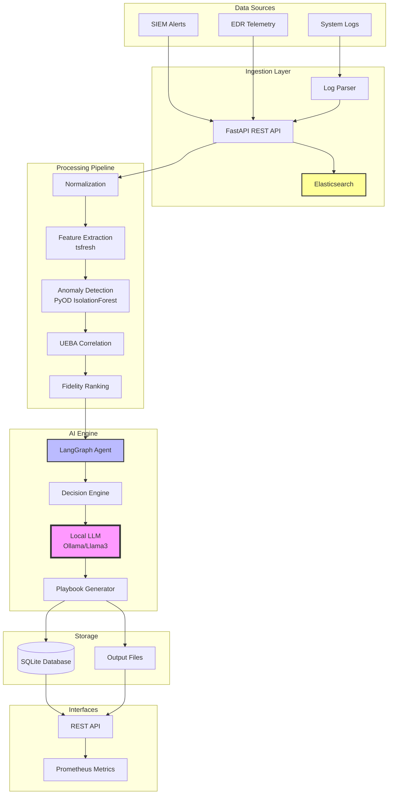
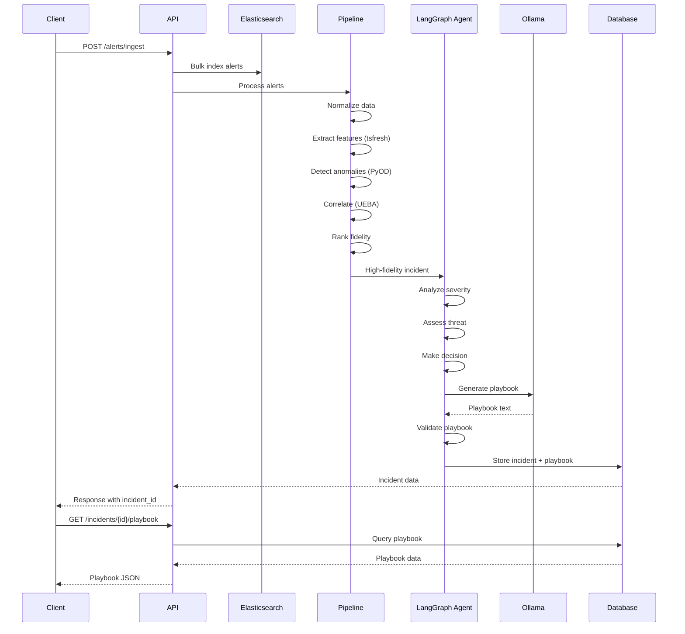
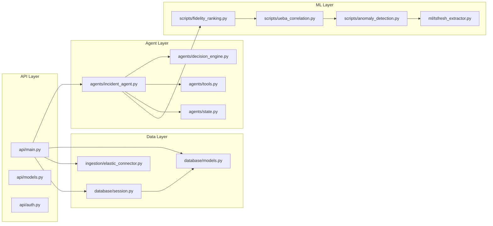
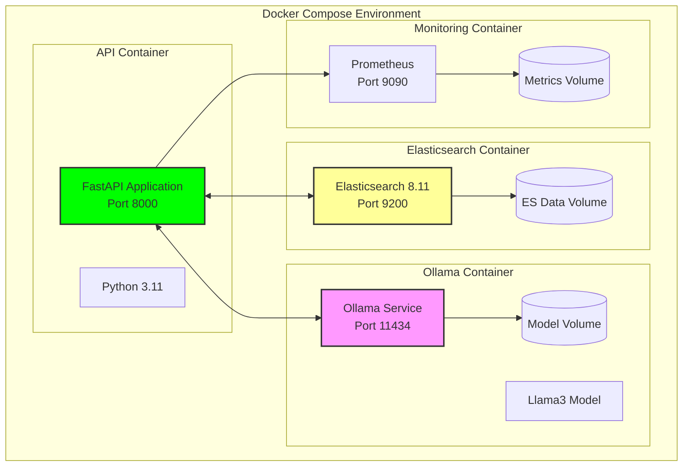
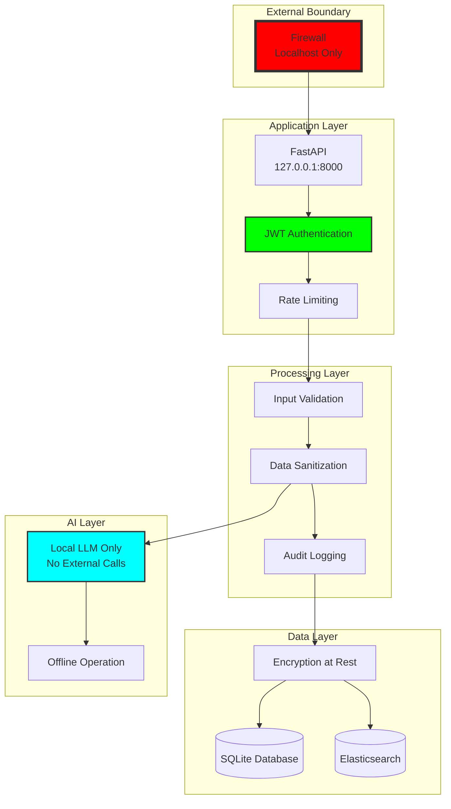

# System Architecture

This document provides a comprehensive overview of the Cyber Incident Response AI system architecture.

---

## High-Level Architecture

---

## Data Flow Diagram

---

## Component Architecture

---

## Deployment Architecture

---

## Security Architecture

---

## Technology Stack

| Layer | Technology | Purpose |
|-------|-----------|---------|
| **API** | FastAPI | REST API endpoints |
| **Orchestration** | LangGraph | Agentic workflow |
| **LLM** | Ollama (Llama3) | Local playbook generation |
| **ML** | PyOD, tsfresh | Anomaly detection, feature extraction |
| **Search** | Elasticsearch | Log storage and search |
| **Database** | SQLite/PostgreSQL | Persistent storage |
| **Monitoring** | Prometheus | Metrics collection |
| **Testing** | pytest | Unit and integration tests |
| **Containerization** | Docker Compose | Service orchestration |

---

## Key Design Principles

1. **Offline-First**: All processing happens locally, no external API calls
2. **Explainability**: Full audit trail and reasoning traces
3. **Modularity**: Clean separation of concerns
4. **Scalability**: Designed for high-volume alert processing
5. **Security**: Defense-in-depth with multiple security layers
6. **Testability**: Comprehensive test coverage
